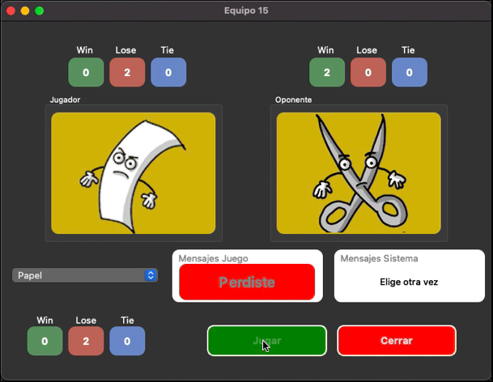

# Rock Paper Scissors Game

## Screenshot

## My process

The game consists of two players choosing rock, paper or scissors and with the rules already established, the winner is decided. This is the basis of our program, which was implemented with variables and conditions such as an IF.

The second part or stage of this project would be the implementation of the TCP protocol, to be able to make the multiplayer and remote game through networking. In this stage, the implementation of a TCP server will be carried out that will receive the messages from both players and will also forward them so that the selection made by the other player can be known. Also, a kind of virtual queue was implemented, so that, if several players want to play, they can wait until one of them leaves and he can take his place and thus start the game again.

The server must have the ability to receive the connections of two players and interact with them to play the game.

The server phases are the following:
- Connection: In this phase, with the TCP protocol, you must wait for the two players to connect.
- Game: For the game phase, the choice of both connected players is expected and the choice of the other player is expected, the server will send the choice, the client will handle the game logic, and at the end the result will be displayed.
- Completion: For the completion phase, it is done by either of the two players. If one leaves, this message is sent and it is asked if you want to wait for another opponent and wait for another opponent to connect. Likewise, you can exit the program if you don't want to wait for another player or you don't want to play.

The third stage and the most complicated of all, the implementation of the virtual interface. With the help of QT software, it is relatively easy to create a graphical interface with all the elements that this entails, the window, text boxes, buttons, displaying images, where that is relatively simple, but this stage also involves achieving integration between the graphical interface and the Python program, which is the most difficult part of the whole process.

These elements were made for the graphical interface:
- 1. The option selected by the local player
- 2. The option selected by the remote player
- 3. An option selector
- 4. A button to submit selection
- 5. One button to close the game
- 6. An area to display game messages
- 7. An area for app messages
- 8. A section for the record with the current player
- 9. A section for the total record

## Author

Luis David Jimenez Martinez
- Portfolio - [www.luisdavidjm.com](https://www.luisdavidjm.com)
- GitHub - [LuisDavidJM](https://github.com/LuisDavidJM)
